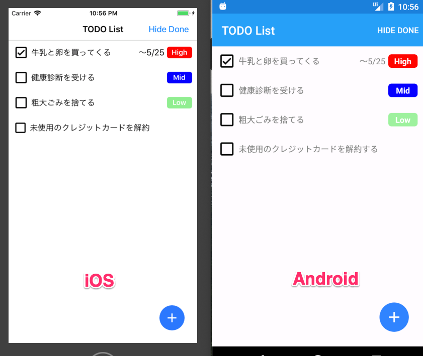
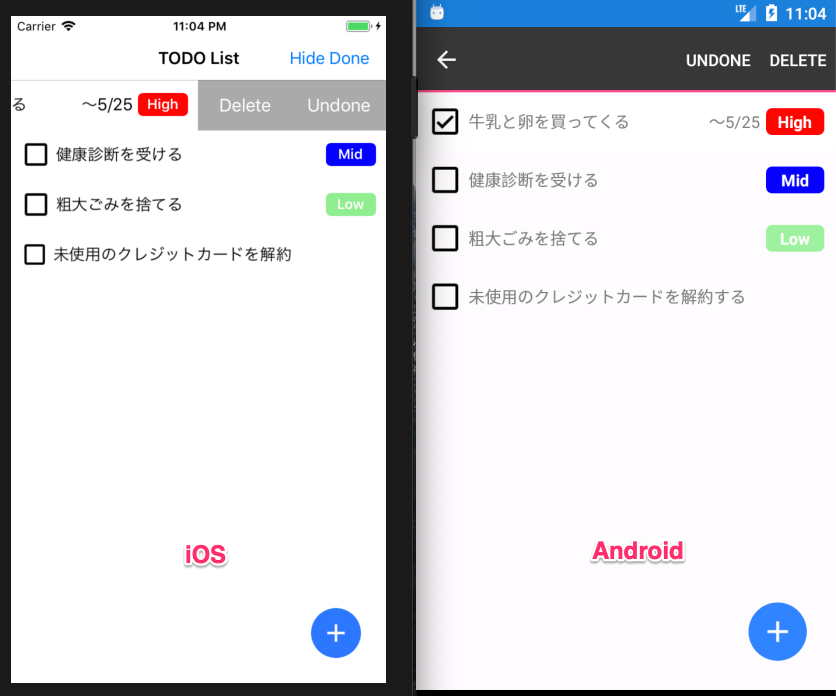
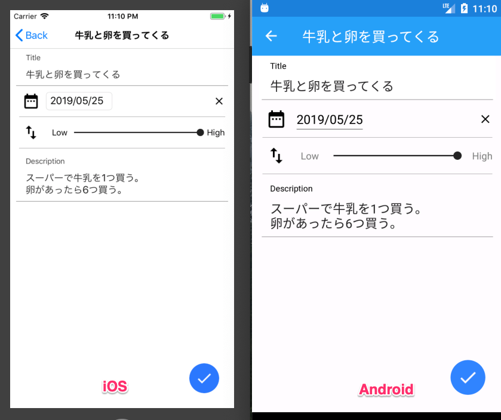
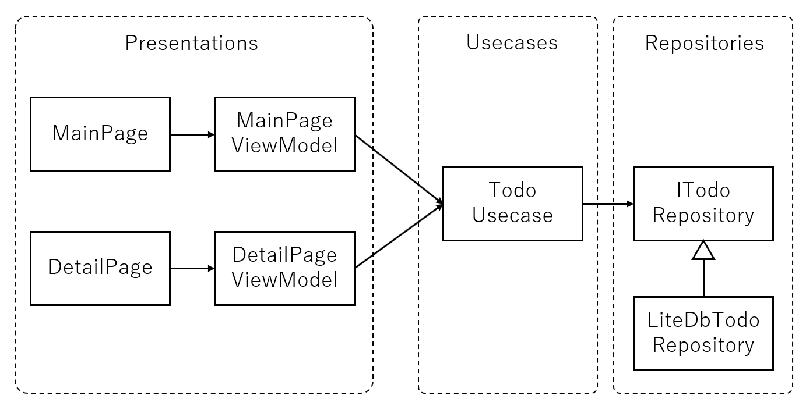

Xamarin.Forms Visual によるマテリアルな iOS/Android アプリのサンプル
----

## これは何？

Xamarin.Forms 3.6 で **Xamarin.Forms Visual** という機能が追加されました。

* [Beautiful Material Design for Android & iOS | Xamarin Blog](https://devblogs.microsoft.com/xamarin/beautiful-material-design-android-ios/)
* [Xamarin.Forms Visual - Xamarin | Microsoft Docs](https://docs.microsoft.com/en-us/xamarin/xamarin-forms/user-interface/visual/)

このリポジトリは、この Xamarin.Forms Visual を使用して Material デザインを適用した Android/iOS 向けのサンプルアプリケーションです。

## Xamarin.Forms Visual とは何か？

Xamarin.Forms Visual は、 ``ContentPage`` や各UIパーツに存在する ``Visual`` プロパティに定義された値を指定することによって、そのUIパーツの **見た目や挙動を切り替える** 機能です。

公式で用意された、Visual プロパティへ設定可能な値には、

* ``Default`` 
* ``MatchParent``
* ``Material``

があり、[Material](https://docs.microsoft.com/en-us/xamarin/xamarin-forms/user-interface/visual/material-visual) は、Visual への設定値の一つです。

``Page`` や各種View の ``Visual`` プロパティに ``Material`` を設定することで、対応したUIパーツが Material デザインになります。

Visual の実態は Custom Renderer であり、``Material`` と設定された場合には、[Material 用の Custom Renderer](https://docs.microsoft.com/en-us/xamarin/xamarin-forms/user-interface/visual/material-visual#customize-material-renderers) が動作し、Material デザインのような見た目と挙動を実現しています。

見た目だけを切り替えるのであれば [Themes](https://docs.microsoft.com/en-us/xamarin/xamarin-forms/user-interface/themes/) や [Styles](https://docs.microsoft.com/en-us/xamarin/xamarin-forms/user-interface/styles/) という機能が既に存在していますが、「挙動」も含めた柔軟な UI の変更が求められる場合には Visual を使用すべきです。

## 必要な環境

### 開発環境

* Windows - Visual Studio 2017 または 2019
* macOS - Visual Studio for Mac ver 8.0.5 (作者はこちらを使用しています)

### 実行環境

* Android - Android 5.0 以降の実機端末またはエミュレータ
* iOS - iOS 8.0 以降の実機端末またはシミュレータ

※UWP には対応していません。

## 実行(ビルド)方法

Visual Studio 2017/2019 または Visual Studio for Mac で ``XamMaterialTodo.sln`` ファイルを開き、実機またはエミュレータをデプロイ先に選択して実行してください。

## どんなサンプル？

さて、この Visual Material に触れるサンプルとして、簡単な ToDo アプリケーションを作成しました。

### メイン画面



* ToDo の一覧画面で、上から優先順位の高い順、期限の近い順に表示されます
* 右上のボタンで、完了した ToDo を隠すかどうかを切り替えられます
* 右下のボタンで、新しい ToDo を追加できます

### メイン画面(コンテキストメニュー)



* iOS ではスワイプ、Android では長押しでコンテキストメニューが表示でき、ToDo の削除と未完了に戻す事ができます。

### ToDo 詳細画面



* ToDo のタイトル、期日、優先順位、詳細が登録できます
* 右下のボタンで ToDo を「完了」にできます

## Xamarin.Forms における Material デザイン適用の実際

アプリに簡単にマテリアルデザインを適用できる、という触れ込みの Xamarin.Forms Visual Material ですが、実際には満足が行く程度にまでマテリアルな見た目にするには、アプリケーションでの実装を「がんばる」必要があります。

このサンプルアプリケーションも、「そんなにマテリアルか？」と言われると「…はい」としか答えられないです。。。

それは、現在対応 Material にしているUIパーツは以下の11個(*付きはサンプルアプリで使用しています)だけであり、これらだけでは「Material なアプリ」を作ることは難しいためです。

* Button
* Entry(*)
* Frame(*)
* ProgressBar
* DatePicker(*)
* TimePicker
* Picker
* ActivityIndicator
* Editor(*)
* Slider(*)
* Stepper

[Material Design](https://material.io/design/) 公式で提示されている Components や、マテリアルデザインの提供者である Google が開発しているクロスプラットフォームアプリ開発ツール [Flutter の Material Widgets](https://flutter.dev/docs/development/ui/widgets/material) と比較すると、パーツの数も再現度も貧弱と言わざるを得ません。

### 対応されていないUI部品は？

CustomRenderer を自作するか、既存の部品を組み合わせてそれっぽく見せるしかないです。

例えば、[FAB(Floating Action Button)](https://material.io/design/components/buttons-floating-action-button.html) は、このサンプルでは、ただの丸い ``ImageButton`` です。

```xaml:
<ImageButton Grid.Column="1" Grid.Row="1"
    Source="https://raw.githubusercontent.com/amay077/XamMaterialTodo/master/img/baseline_add_white_48dp.png"
    BackgroundColor="#2B78FE" 
    Padding="10" CornerRadius="25" 
    WidthRequest="50" HeightRequest="50"  
    VerticalOptions="Center" HorizontalOptions="Center"
    Command="{Binding AddCommand}"/>
```

「もっと Material デザインにしたい！」という方は、2019年3月末に Xamarin チームが「Xamarin Visual Challenge」というオンラインイベントを行っていました。著名なアプリのデザインを Xamarin Forms を使って再現してみよう、という趣旨で、その結果は GitHub のリポジトリから見る、使うことができます。

* [Join the Xamarin Visual Challenge | Xamarin Blog](https://devblogs.microsoft.com/xamarin/join-the-xamarin-visual-challenge/)
* [Visual Challenge Conquered! | Xamarin Blog](https://devblogs.microsoft.com/xamarin/visual-challenge-conquered/)
* [Pull Requests · davidortinau/VisualChallenge](https://github.com/davidortinau/VisualChallenge/pulls)

投稿された Pull Requests を見てみると、どのようにして Material デザインを再現したかが分かりますので、参考にしてみてください。「皆さん、自力で頑張ってるなあ」という感想を持ちました(Visual Material あまり関係なくない？ともw)。

### Visual と Shell

2019年5月29日に Xamarin.Forms 4.0 がリリースされ、Shell という機能が公式に提供されました。

* [Welcome to the Shell Era: Xamarin.Forms 4.0 Released | Xamarin Blog](https://devblogs.microsoft.com/xamarin/introducing-xamarin-forms-4-0-the-era-of-shell/)
* [Xamarin.Forms Shell - Xamarin | Microsoft Docs](https://docs.microsoft.com/en-us/xamarin/xamarin-forms/app-fundamentals/shell/)

Shell とは、スマホアプリでよく使用される画面パターンをフレームワークとして提供し、その画面パターンが適用できるのであれば高速に「モダンな」アプリが開発できる、というものです。

Visual とは直接関係はなく、Shell のソリューションテンプレートでも Visual は使用されていませんが、Shell と Visual を併用すると、「より Material でモダンな」アプリが作りやすいものと思います。例えば、このサンプルアプリの iOS 版はヘッダが白い背景色ままですが、Shell で作ったアプリの iOS 版は、Android 版と同じくヘッダが青い背景色になります。

## サンプルアプリの設計

ここからは Visual Material に関係のない、ただの GUI アプリケーション設計の話です。興味のない方は読むのをやめて頂いて OK です。

このサンプルアプリケーションは MVVM パターンを採用しています。DDD や Clean Archtecture から「Usecase」や「Repository」という概念も採用しています。

プラットフォーム側での固有処理は行っておらず、共通の XamMaterialTodo プロジェクトですべての実装を行っています。

XamMaterialTodo プロジェクトのクラス図は以下のようになっています。




また、ディレクトリ(名前空間)構成は以下のようになっています。

```
/XamMaterialTodo
 ├/DataModels
 ├/Repositories
 ├/Usecases
 └/Presentations
   ├/Main
   └/Detail
```

### DataModels 名前空間

プロジェクト共通で使用するデータクラスが含まれています。今回は一つの ToDo を表す ``TodoItem`` のみが含まれ、あらゆる箇所で使用されます。

### Repositories 名前空間

データストアから、 ``TodoItem`` 読み出し、または保存する Interface 定義とその実装クラスを含みます。

今回はデータストアに LiteDB を採用しました。

* [LiteDB :: A .NET embedded NoSQL database](https://www.litedb.org/)

端末内のデータストアといえばまずは SQLite が想定されると思いますが、SQLite は、テーブルを設計・作成したり、データのI/Oのために SQL を記述する必要があるなどの面倒さがあります。
LiteDB は。MogoDB のようなドキュメント指向の NoSQL で、``TodoItem`` をそのまま扱える利点があります。またすべて C# で実装されており、導入も簡単です。

LiteDB に対してのデータIOは ``LiteDbTodoRepository`` として実装されています。

SQLite, Firebase Firestore, AppCenter Data といった他のデータストアに対応したい場合は、 ``ITodoRepository`` インターフェースを実装して新しいリポジトリクラスを作成し、``LiteDbTodoRepository`` と差し替えるだけです。

### Usecases 名前空間

この層にはToDoアプリについてのビジネスロジックを実装したクラスが含まれます。
今回は機能の少ない単純なアプリであるため、``TodoUsecase`` クラスが一つだけあり、「ToDo の追加や削除」、「ToDo の完了」、「未完了または全ての ToDo 一覧の取得」などの機能が実装されています。もちろんその実装には ``ITodoRepository`` が使用されています。 

### Presentation 名前空間

この層には、いわゆる MVVM の V(View) と VM(ViewModel) が含まれます。

サブディレクトリ ``Main`` は ToDo 一覧画面、 ``Detail`` が ToDo 詳細画面を示し、それぞれのディレクトリに画面を示す ``Page`` クラスと、 ``ViewModel`` クラスが含まれます。多くの人は ``Viws`` と ``ViewModels`` でディレクトリや名前空間を分けると思いますが、View と ViewModel はペアで密結合しているため、画面ごとにディレクトリを分けてみました。[^1]

[^1]: これは [DroidKaigi2019 アプリの構成](https://github.com/DroidKaigi/conference-app-2019) を参考にしています。

#### ReactiveProperty と Reactive Extensions

Page とのデータバインディングに必要な ViewModel の INotifyPropertyChanged の実装は [ReactiveProperty](https://github.com/runceel/ReactiveProperty) を採用しています。

Reactive Extensions については、使い倒してはいませんが、``DetailPageViewModel`` にていずれかの入力項目が変化した時、「変更されたバージョンの ``TodoItem`` を作り直す」という処理で活用しています。

```csharp:
// いずれかの項目が変化したら TodoItem を作り直す
UpdatedItem = Observable.CombineLatest(
    Title, Description, Priority, HasDueDate, DueDate,
    (title, description, priority, hasDueDate, dueDate) =>
        new TodoItem(item.Id, title, IsDone.Value, description, priority, 
            hasDueDate ? dueDate : (DateTimeOffset?)null, item.CreateDate))
    .ToReadOnlyReactiveProperty();
```


## 参考にしない方がよい点

コピペだけで作ると後で痛い目を見るかも、という点を挙げてみました。

### 画像の表示

画像の表示では、 

```xml:
<ImageButton Grid.Column="1" Grid.Row="1"
    Source="https://raw.githubusercontent.com/amay077/XamMaterialTodo/master/img/baseline_add_white_48dp.png"
```

のように URL を直接指定していますが、動的に変化する画像でなければ、アプリ内にリソースとして持つべきです。

### 画面遷移

ViewModel から画面遷移を行う方法は、今回は、

1. ViewModel で画面遷移リクエストイベントを発生
2. Page でそれを受信して画面遷移

という方法を採用していますが、中〜大規模なアプリケーションな場合は、Prism などのフレームワークを使ってその仕組みに従った方が良いです。

### リソース解放処理

* 上記の画面繊維で、Page でのイベント受信 (``MainPage.xaml.cs`` など)
* ViewModel 内での、 ``IObservable`` の ``Subscribe`` (``DetailViewModel.cs`` など)

これらの箇所では、イベントの ``-=`` での登録解除や、``Subscribe()`` の戻り値である ``IDisposable`` の ``.Dispose()`` を呼ぶべきかについて、注意を払う必要があります。

### ReactiveProperty について

``TodoUsecase`` では、 ``ReactiveProperty<T>`` よりも ``ReactivePropertySlim<T>`` を使用した方が良いでしょう。xxxSlim の方が、シンプルで軽量です（[ReactivePropertySlim詳解 - neue cc](http://neue.cc/2018/01/18_562.html)）。

## ストレスの少ない画面開発(HotReload)について

Flutter や React の開発ツールは、コードを変更すると実行中のアプリケーションにすぐにそれが適用される、いわゆる「HotReload」という仕組みが用意されています。

一方、Xamarin では、Visual Studio に搭載されている "XAML Previewer" を通常は使用します。

* [XAML Previewer for Xamarin.Forms - Xamarin | Microsoft Docs](https://docs.microsoft.com/en-us/xamarin/xamarin-forms/xaml/xaml-previewer/?pivots=windows)

しかし XAML Previewer は Android や iOS の画面をシミュレートしているため、プラットフォームに依存したUI部品は描画されなかったり、Previewer 自体が機能しなくなったりとあまりストレスの軽減になっていないと個人的には感じます。

このサンプルでは、Xamarin.Forms でも HotReload を実現する LiveXAML というツールに必要な(nuget)ライブラリを同梱しています。

* [LiveXAML for Xamarin Forms](https://www.livexaml.com/)

Visual Studio に LiveXAML の拡張機能をインストールして、アプリを実行すると、``xxx.xaml`` を変更して保存すればすぐに実行中のアプリに反映されます。有償ツールですがトライアル期間があり、それが切れても xaml ファイルが3つまでなら使用できますので、よければ試してみてください。私は LiveXAML で、画面開発の快適度が格段に上がりました。

* [Xamarin.Forms でも HotReload がしたい！ - Qiita](https://qiita.com/amay077/items/150f484e68924468a2c3)